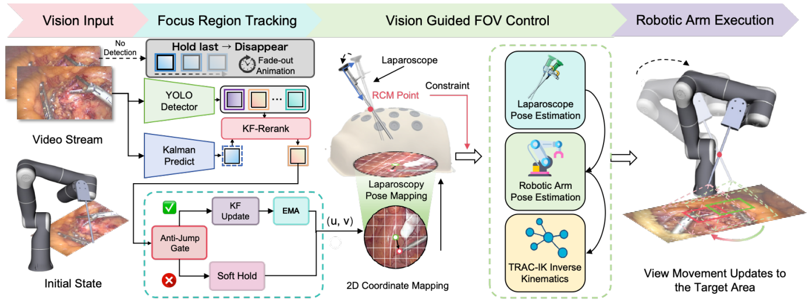

# See What Matters: Closed-Loop Laparoscopic Camera Control Driven by Learned Surgical Attention

This is the repository that contains source code for the [SurgAtt-PnP](https://github.com/SurgAtt-PnP/Closed-Loop-Laparoscopic-Camera-Control-Driven-by-Learned-Surgical-Attention/).

The code will be lease after the paper was accepted.

The whole framework of the proposed method:

# Website License
 This work is licensed under a <a rel="license" href="">Creative Commons Attribution-ShareAlike 4.0 International License</a>.
